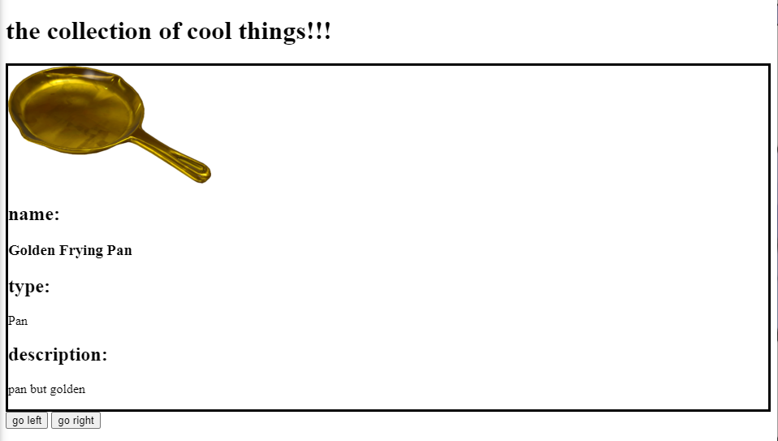

# Special Stockpile (hard)

A simple project where you get to show your favorite things, and where you get to apply what you learned about data types, arrays, and objects in Javascript.

## Example screenshot:



## Part 1: Initial file setup

Create your files:
- script.js
- index.html
- style.css

## Part 2: Prepare the HTML file

In your index.html file, create a div in the body that includes the following elements (header titles do not have to be identical, but this is a starting point):
- img with an id like "visual" or another similar id
- a header with "name:" in it's innerHTML
- a header or p with the id "obj-name"
- a header with "type:" in it's innerHTML
- a p with the id "desc"

Outside of the div you just made, create two buttons containing the text "left" and "right" respectively. As with some of the elements in the div, include an id for each one (i.e. "left-button" for the left one, and "right-button" for the one on the right. The buttons can either come before or after the div.)

## Part 3: Prepare the CSS file

In your style.css file, create a simple CSS selector for the div element. For now, let's set a border style of `solid`. 

## Part 4: Prepare the JS file 

This is where you can apply what you learned about objects, arrays, and data types. 

First we will start with the objects:


### Part 4a: Creating objects

First, think of a category of objects you like. For example, you can pick your favorite foods.

In your Javascript window, create an object called object1. In your new object, include the following properties:

- imgsrc
- name
- type
- desc

Here is an example of an object:
```javascript
var object3 = { 
  imgsrc: "myImageURL.com" ... 
  // you can fill in the remaining properties
}
```

Once you have done so, fill in each of the properties. Paste in the link for the image you want to use in front of imgsrc, and then also include text for the other properties.

Check if you've created your object properly by printing it to the console.

In your console, you should see the text entered in each property of the object. For example, if we do this with our placeholder object, you should see something like this:

```javascript
// [object Object]
{
  imgsrc: "myImageURL.com" ...
// the other properties
}
```

Once you feel satisfied with this first object, make at least two more objects with the same properties as the first one. You may want to name these objects in a similar way to the first one, such as "object2", "object3", and so forth. Use the other objects to represent other things you like. You can print out the other objects to check if you set them up correctly by changing "object1" in the console.log shown earlier. For example, making a print for each object will look like this:

```javascript
// [object Object]
{
  imgsrc: "myImageURL.com" ...
}
// [object Object]
{
  imgsrc: "myImageURL.com" ...
}
// [object Object]
{
  imgsrc: "myImageURL.com" ...
}
```


### Part 4b: Creating the array


Once you have your objects created, create an array to store all the objects. We can name this array "things".

As with the individual objects, you can use `console.log` to print out the contents of all the objects in the array. It should look something like this:
```javascript
// [object Array] (3)
[// [object Object]
{
  imgsrc: "https://wiki.teamfortress.com/w/images/thumb/b/bc/GoldenFryingPan.png/250px-GoldenFryingPan.png",
  name: "Golden Frying Pan",
  type: "Pan",
  desc: "pan but golden"
},// [object Object]
{
  imgsrc: "https://i.ebayimg.com/images/g/FqkAAOSwOyRgsMe8/s-l640.jpg",
  name: "Sakuya Izayoi fumo",
  type: "fumo",
  desc: "funni meido"
},// [object Object]
{
  imgsrc: "https://static.tvtropes.org/pmwiki/pub/images/fotoacecombatzero_thebelkanwarjapons.jpg",
  name: "Ace Combat Zero: The Belkan War",
  type: "game",
  desc: "cool and epic video game"
}]
```

## Part 5: DOM magic

To have a way to present what we had in our objects, we will make use of DOM, or Document Object Model. For the time being, just know that it allows us to modify what is on the screen (You will get to learn more next week).


To see what an object contains and to change the object shown, paste the following after your array in the Javascript file:

```javascript
// getting elements based on the ids in the HTML file
var visual = document.getElementById("visual");
var objName = document.getElementById("obj-name");
var type = document.getElementById("type");
var desc = document.getElementById("desc");

// button setup based on the ids set
var lButton = document.getElementById("leftbutton");
var rButton = document.getElementById("rightbutton");

// initalize counter of current index and max count, start at first index
var thingIndex = 0;
/* 
.length will return a value one larger than the value of 
the last index, subtract by 1 to know what the number of 
the last index is
*/
var maxIndex = things.length - 1;

// button functions for clicking of left and right buttons
lButton.onclick = function(){
  console.log("left button");
};

rButton.onclick = function(){
  console.log("right button");
};

/* 
general updateContent function, allows us to not have to type
each of the individual functions inside multiple times 
*/
// create function updateContent here

// setting the first image and set of text to display by using the function just made
updateContent(thingIndex);

// event listener for left button
lButton.addEventListener("click", function(){
    
  // if current index same as the leftmost index of array...
  if(thingIndex == 0){
    /* 
    set the index to the largest index so you can wrap
    around to the last entry of the array 
    */
    thingIndex = maxIndex;
  } else {
    // else just go back one entry
    thingIndex--;
  }
    // console.log(thingIndex);
  
    // change the image and text to what's at new index
    updateContent(thingIndex);
});

// event listener for right button
rButton.addEventListener("click", function(){
  
  // if current index same as greatest index number...
  if(thingIndex == maxIndex){
    /*
    set index back to the first index at 0 to wrap back
    around from the last entry to the first entry
    */
    thingIndex = 0;
  } else {
    // else just move to the next index
    thingIndex++;
  }
    // console.log(thingIndex);
  
    // change image and set text to ones at new index
    updateContent(thingIndex);
});
```

In the designated space of the provided boilerplate code, create the updateContent function. This function takes in a value `thingIndex`, and does the following inside:
-

In the code, we notice one data type being used. In this case, it is the `number` datatype. It is one of Javascript's primitive data types, with the `string` data types we used in our objects being another such datatype.

Once this code is pasted in, you should notice that the image and text belonging to the first object are appearing in the box on the screen. If you click the buttons, you should notice that the item displayed is different after each button press. If nothing is appearing in the box, double check that the name of your array is "things". This is to make sure the DOM code has the correct array referenced. 

## Bonus stage: Stretch goals

Finished ahead of time? Here are some ideas of other additions and improvements you may want to try:
- For those that want to try what's coming next, add another button that allows you to go to the first or last item in your array, or even randomize the choice. This can help you get an understanding of how the DOM content works: [https://www.w3schools.com/js/js_htmldom_document.asp](https://www.w3schools.com/js/js_htmldom_document.asp)
- Add an input field to pick which numbered entry to access (refer to your work on last week's tip calculator).
- Add more objects! Go crazy!
- Customize the HTML and the CSS file. For example, you can change the name at the top of the page, or change the color of the div. (Just be careful to not mess up anything with an id, as this prevents items to be displayed or cycled.

## References
- [https://www.w3schools.com/js/js_object_definition.asp](https://www.w3schools.com/js/js_object_definition.asp)
- [https://www.w3schools.com/js/js_arrays.asp](https://www.w3schools.com/js/js_arrays.asp)
